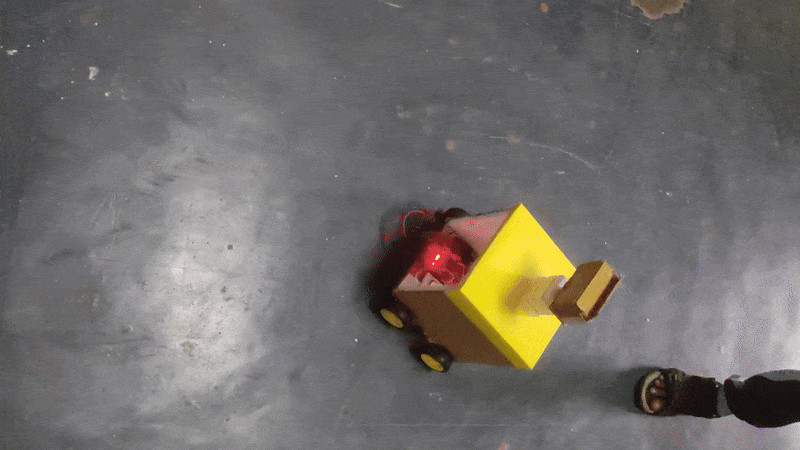
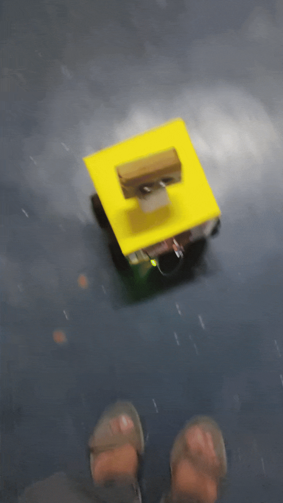

# Advanced Driver Assistance System (ADAS) Implementation

## 🎥 Demo Videos

* ### 🎬 Introduction

  

* ### 🔄 Round Movement

  

* ### ⬆️ Front Movement

  

   

## ❓ What is ADAS?

Advanced Driver Assistance Systems (ADAS) are intelligent systems that help drivers by providing enhanced safety and driving experience. These systems utilize sensors, cameras, and control algorithms to:

* Detect potential hazards
* Automate certain driving functions
* Provide critical information to the driver
* Take preventive actions when necessary

## 🤔 Why ADAS?

Key reasons for ADAS development:

* **Safety**: Reduces human error (cause of 94% of accidents - NHTSA)
* **Efficiency**: Optimizes driving patterns for fuel/energy savings
* **Comfort**: Reduces driver fatigue in traffic/long drives
* **Regulation**: Meets evolving automotive safety standards
* **Foundation**: Building block for autonomous vehicles

## 💡 Use Cases of ADAS

1. **Collision Avoidance** (Implemented)
2. **Lane Keeping Assist** (Implemented)
3. **Automatic Parking** (Implemented)
4. **Adaptive Cruise Control**
5. **Blind Spot Detection**
6. **Driver Drowsiness Detection**

## ⚖️ Manual Driving vs ADAS

| Feature            | Manual Driving      | ADAS Assisted Driving                 |
| ------------------ | ------------------- | ------------------------------------- |
| Obstacle Detection | Human reaction time | Real-time ultrasonic sensing          |
| Decision Making    | Driver-only         | Sensor data + microcontroller logic   |
| Parking Assistance | Manual estimation   | Automated distance-based logic        |
| Speed Control      | Driver input        | Controlled by predefined safety logic |
| Alerts & Warnings  | Horns / lights      | Automated buzzer + LED alerts         |

## 🎯 Project Objectives

This project demonstrates a **basic ADAS implementation** using an Arduino-compatible microcontroller and sensor suite to simulate:

* Obstacle detection and avoidance
* Emergency braking
* Lane-following using IR sensors
* Automatic parking mode
* Speed control and mode switching (Auto, Manual, Parking)
* Bluetooth support for command handling

## 🛠️ System Capabilities

* **Autonomous Mode:** Line following with obstacle avoidance
* **Manual Mode:** Future support for remote/Bluetooth control
* **Parking Mode:** Forward parking with obstacle-based halting
* **Obstacle Avoidance:** Left/right scanning and intelligent redirection
* **Emergency Stop:** Immediate halt when obstacle is too close
* **Speed Control:** Adjustable auto speed via commands
* **Alerts:** Buzzer and LED for event signaling

## ⚙️ Implementation Requirements

### 🔌 Hardware:

* Arduino Uno or compatible microcontroller
* L298N Motor Driver x2
* Ultrasonic Sensor (HC-SR04)
* IR Sensors x2
* Servo Motor (for directional scanning)
* Buzzer
* LED
* DC Motors (Left & Right wheels)
* Bluetooth Module (e.g., HC-05)
* Power Supply (Battery or USB)
* Chassis & Wheels

### 💻 Software:

* Arduino IDE
* Libraries:

  * `Servo.h`
  * `L298N.h` (external motor driver library)
  * `NewPing.h`
  * `SoftwareSerial.h` (for Bluetooth)

## 🧩 Software Architecture

Key Functional Blocks:

1. **Sensor Input Layer**

   * Continuous distance monitoring
   * Line sensor polling
2. **Decision Layer**

   * State machine for mode handling
   * Collision risk assessment
3. **Actuation Layer**

   * Motor control
   * Steering servo control
4. **User Interface**

   * Bluetooth commands
   * Audible/visual feedback

*(placeholder for flowchart)*

## 🏁 Accomplishments

✅ Fully functional obstacle avoidance system
✅ Accurate line following implementation
✅ Working parking assist mode
✅ Smooth mode transitions (auto/manual/parking)
✅ Emergency stop functionality
✅ Configurable speed parameters

## 🚀 Getting Started

1. Clone this repository
2. Upload `main.ino` to Arduino
3. Assemble hardware per pin definitions
4. Power on and send commands:

   * 'A': Autonomous mode
   * 'M': Manual mode
   * 'P': Parking mode
   * '+/-': Speed adjustment

## 🔢 Pin Configuration Summary

| Component         | Pin(s)                                                |
| ----------------- | ----------------------------------------------------- |
| Ultrasonic Sensor | A4 (Trig), A5 (Echo)                                  |
| IR Sensors        | 8 (Left), 9 (Right)                                   |
| Servo Motor       | 7                                                     |
| Buzzer            | 3                                                     |
| LED               | 2                                                     |
| Motors            | FL:4, VL:6, BL:5 (Left) / FR:12, VR:11, BR:13 (Right) |

 

## 🔮 Future Enhancements

1. Add camera-based object recognition
2. Implement vehicle-to-vehicle communication
3. Add machine learning for pattern recognition
4. Improve parking algorithm for parallel parking
5. Improve servo-based path planning with finer logic
6. Implement data logging for performance analysis
7. Integrate GPS for navigation support

 

## 👨‍💻 Contributors

* **Akash Adhya** — Developer and Team Lead
* **Prakas Dutta** — Developer and Supporting Engineer
* **Anurag Sarkar** — Developer and Supporting Engineer
* **Suvranil Chattopadhyay** — Engineer

---

🔗 *This project serves as a foundational step into autonomous vehicle systems using embedded development. It’s a perfect mix of hardware and software to bring real-world ADAS logic to life in a simplified, low-cost format.*
